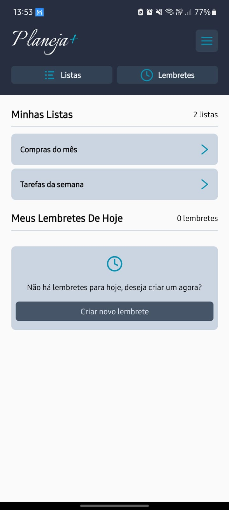
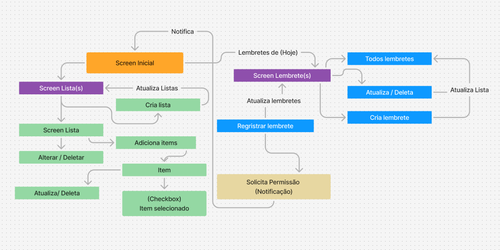
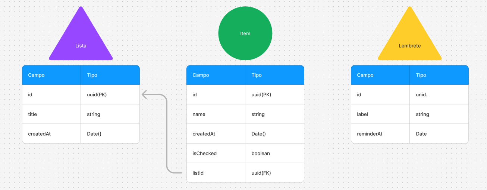

<div align="center">
  

  ### Uma aplicação mobile desenvolvida para simplificar suas listas de compras e tarefas!
  #### Crie lembretes e mantenha-se organizado com facilidade e objetividade.
</div>
  
---

## Sobre o Projeto

O **Planeja Plus** nasceu da necessidade de resolver um problema cotidiano observado por minha esposa.

A dificuldade em encontrar um aplicativo de gerenciamento de listas que fosse simples e direto motivou a criação desta solução.

Na maioria dos aplicativos disponíveis continha excesso de informações e complexidade, comprometendo a experiência do usuário.

Nossa ideia de criação do Planeja Plus é ter uma ferramenta objetiva e fácil de usar, e hoje é o aplicativo que utilizamos diariamente para organizar nossas compras e tarefas.

<div align="center">
  
</div>


---

## Tecnologias

- [React-Native]()
- [Expo]()
- [Typescript]()
- [Expo Router]()
- [Date Fns]()
- [Nativewind]()
- [Zustand]()
- [Tailwindcss]()
- [Expo]()
- [Async Storage]()
- [Expo Notifications]()
- [Draggable Flatlist]()

---

## Experimente o Aplicativo

Para experimentar o Planeja Plus, siga os passos abaixo:

1. **Baixe o arquivo APK** clicando no link abaixo.
2. **Transfira o APK** para o seu dispositivo Android.
3. **Localize o arquivo** no gerenciador de arquivos do seu dispositivo.
4. **Instale o aplicativo** clicando no arquivo baixado.

[Baixar Planeja Plus](/build.apk)

---

## Fluxo da Aplicação

### Tela Inicial
- Exibe as listas e lembretes do usuário para o dia atual.

### Tela de Listas
- Permite ao usuário visualizar todas as suas listas e criar novas listas.

### Tela de Lista
- O usuário pode adicionar itens à lista, bem como atualizar ou excluir uma lista existente.

### Item da Lista
- É possível alterar o nome do item, removê-lo ou marcá-lo como concluído usando um checkbox.

### Tela de Lembretes
- O usuário pode visualizar lembretes ativos e concluídos, além de criar, alterar ou excluir um lembrete.

<div align="center">
  
</div>

---

## Estrutura de dados

### Lista
  - A lista deve contar um campo identificador (id) do tipo UUID (Primary Key).
  - Um título (title) do tipo string.
  - Um campo de data de criação (createdAt) do tipo string.

### Item da Lista
  - Um identificador (id) do tipo UUID (Primary Key).
  - Um nome (name) do tipo string.
  - Um identificador da lista (listId) do tipo UUID (ForeignKey).
  - Um campo de data de criação (createdAt) do tipo string.
  - Um campo de status de conclusão (isChecked) do tipo boolean.

### Lembrete
  - Um identificador (id) do tipo UUID (Primary Key).
  - Um rótulo (label) do tipo string.
  - Um campo de data e hora de lembrete (reminderAt) do tipo Date.

<div align="center">
  
</div>


---

## Configurações Necessárias para Lembretes no Android

Para que a funcionalidade de lembretes funcione corretamente no Android, é necessário adicionar as seguintes permissões ao arquivo `AndroidManifest.xml`:

**Caminho:** `android/app/src/main/AndroidManifest.xml`


```xml
<uses-permission android:name="android.permission.SCHEDULE_EXACT_ALARM"/>
<uses-permission android:name="android.permission.SYSTEM_ALERT_WINDOW"/>

```

## Configurações Necessárias para Lembretes no IOS

Sem considerações específicas para o IOS.

---

## Como executar o projeto localmente

```bash
# Clonar o repositório
git clone https://github.com/cfinotelli/planeja-plus.git

# Entrar no diretório
cd planeja-plus

# Baixar as dependências
npm install | yarn

# Executar o servidor
npx expo start

# Executar no emulador ou No celular
Pressione "a" para Android.
Pressione "i" para IOS.
Para testar no celular será necessário ter o aplicativo Expo Go instalado no dispositivo e ler o QRCODE.

```
