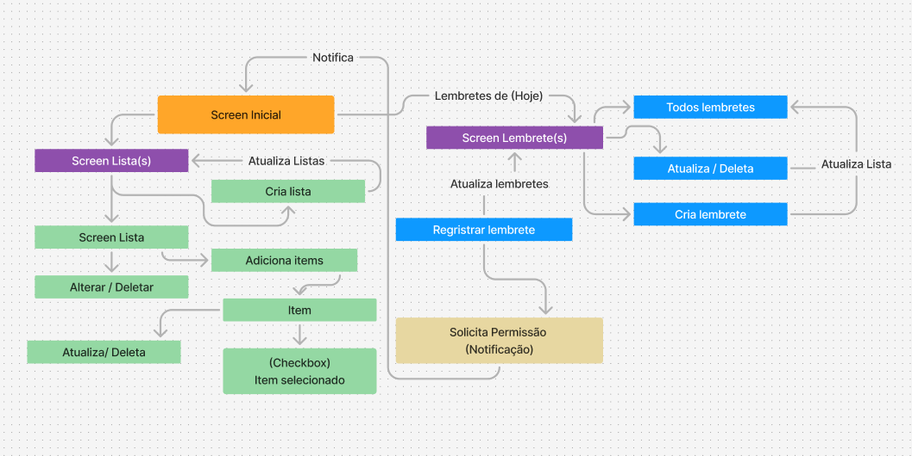

<div align="center">
 

  <h3>Uma aplicação mobile focada em revolver seus problemas com listas simples para compras ou tarefas!</h3>
  <h4>Crie lembretes e fique sempre atento aos seus compromissos!</h3>
</div>

# Sobre

O Planeja Plus foi criado com o intuito de resolver um problema vivenciado pela minha esposa, aonde decidi cria-lo para ser simples e ter uma usabilidade clara e direto ao ponto, todos os mesês minha esposa usou aplicativos para gerenciar suas listas de compras e as opções que ela tinha sempre tinham muita informação em tela, faltava simplicidade e objetividade, com isso o planeja plus foi a ideia que facilitou e hoje é o app que nós dois utilizamos!

##

# Experimente o aplicativo

Para experimentar o aplicativo, faça o download do arquivo apk, envie o arquivo para o seu dispositivo android e busque pelo mesmo no navegador de arquivos, após isto faça a instalação pressionando o arquivo e desfrute!

<a href="build.apk" target="_blank" download="build.apk">Download</a>

##

# Regras de Negocio


 

##

Para que a funcionalidade de lembretes, será necessário adicionar as configurações abaixo para o funcionamento no `android`, sem outras considerações para funcionamento para `ios`.

Será necessario configurar os arquivos no diretorio android para que as funcionalidades do aplicativo sejam executadas corretamente.

path `android/app/src/main/AndroidManifest.xml`

```
  <uses-permission android:name="android.permission.SCHEDULE_EXACT_ALARM"/>
  <uses-permission android:name="android.permission.SYSTEM_ALERT_WINDOW"/>
```
